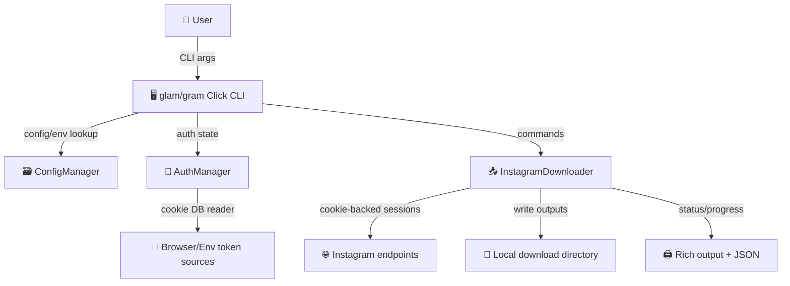

# glam-cli

<div align="center">


</div>

<!-- readme-gen:start:badges -->


<!-- readme-gen:end:badges -->

<p align="center">
  
</p>


> glam-cli is an Instagram command-line tool for downloading posts, profiles, highlights, and stories with safe credential handling and resume-aware media workflows.

<table>
<tr>
<td width="50%" valign="top">

### ⚡️ One Command Interface
Both `glam` and alias `gram` run the same underlying CLI features.

</td>
<td width="50%" valign="top">

### 🔐 Browser-Sourced Auth
Extract cookies from Chrome or Firefox, with optional lock-safe mode (`--no-lock`).

</td>
</tr>
<tr>
<td width="50%" valign="top">

### ♻️ Reliable Resume
Profile download supports resume behavior and safer restart paths for interrupted runs.

</td>
<td width="50%" valign="top">

### 🧰 Dual Package Delivery
Released as a Node wrapper with a Python CLI backend for flexible install options.

</td>
</tr>
</table>

## 🚀 Quick Start

<details open>
<summary><strong>npm (recommended)</strong></summary>

```bash
npm install -g glam-cli
```

</details>

<details>
<summary><strong>Homebrew</strong></summary>

```bash
brew tap Sheshiyer/glam
brew install glam-cli
```

</details>

<details>
<summary><strong>Source</strong></summary>

```bash
git clone https://github.com/Sheshiyer/glam-cli.git
cd glam-cli
python3 -m venv .venv
source .venv/bin/activate
pip install -e .
```

</details>

### Authentication quick path

```bash
# Extract and save cookies from browser profile

glam login --chrome-profile Default --save

# Verify credentials

glam check
```

### Try a profile + post download

```bash
glam profile example_user --limit 10 --resume

glam post https://www.instagram.com/p/ABC123/
```


## ✨ Features

- **Profile download orchestration** (`profile`, `post`, `stories`, `highlights`, `check`)
- **Session-aware config + env support** (`INSTAGRAM_SESSIONID`, `INSTAGRAM_CSRFTOKEN`, `INSTAGRAM_USER_ID`)
- **Config compatibility**: new config defaults under `~/.config/glam/config.json5` with legacy fallback
- **JSON output / quiet mode** for automation-friendly tooling
- **Safer output controls** with optional explicit `--print-env` for credential export

### Core Commands

| Command | Purpose | Auth |
|---|---|---|
| `whoami` | Show account metadata for configured credentials | optional |
| `profile <username>` | Download profile posts (plus optional stories/highlights) | optional |
| `post <url>` | Download a single post/reel/story URL | optional |
| `stories <username>` | Download current stories | required |
| `highlights <username>` | Download profile highlights | required |
| `login` | Extract cookies from Chrome/Firefox | optional |
| `check` | Validate configured credentials | optional |


<!-- readme-gen:start:architecture -->
## 🗂️ Architecture


<!-- readme-gen:end:architecture -->

## Project Structure

```text
📦 glam-cli
├── 📁 src/gram/              # Python CLI implementation
├── 📁 tests/                 # Pytest coverage for auth + downloader + CLI behavior
├── 📁 docs/                  # Architecture and release documentation
├── 📁 scripts/               # Packaging helpers (Node + release scripts)
├── 📁 bin/                   # Entry-point wrappers (`glam`, `gram`)
├── 📁 homebrew/              # Homebrew formula
└── 📄 package.json
```

## 🧪 Repo Health

| Category | Status | Score |
|:---------|:------:|------:|
| Tests | ████████████████░░░░ | 80% |
| CI/CD | ████░░░░░░░░░░░░░░░░ | 20% |
| Type Safety | ████████████████████ | 100% |
| Documentation | ████████████████░░░░ | 80% |
| Coverage | ████████████░░░░░░░░ | 60% |

**Overall: 72%** — Healthy

## 🧰 Configuration & Auth

glam supports either environment-based credentials or file-based config:

- `~/.config/glam/config.json5`
- Legacy fallback: `~/.config/gram/config.json5`

Supported auth variables:

- `INSTAGRAM_SESSIONID`
- `INSTAGRAM_CSRFTOKEN`
- `INSTAGRAM_USER_ID`

Need a safe one-time extraction flow? Use:

```bash
glam login --chrome-profile Default --save
```

(Use `--print-env` only when you explicitly want shell exports.)

## 🧱 Development

```bash
python3 -m venv .venv
source .venv/bin/activate
pip install -e ".[dev]"

ruff check src tests
mypy src
pytest
python3 -m build
```

See [`docs/RELEASE.md`](docs/RELEASE.md) for full release workflows.

<!-- readme-gen:start:footer -->
## 📄 License

MIT © TWC Vault, distributed under the [MIT License](LICENSE).

<div align="center">


**Built with ❤️ by the `glam-cli` contributors**

</div>
<!-- readme-gen:end:footer -->

